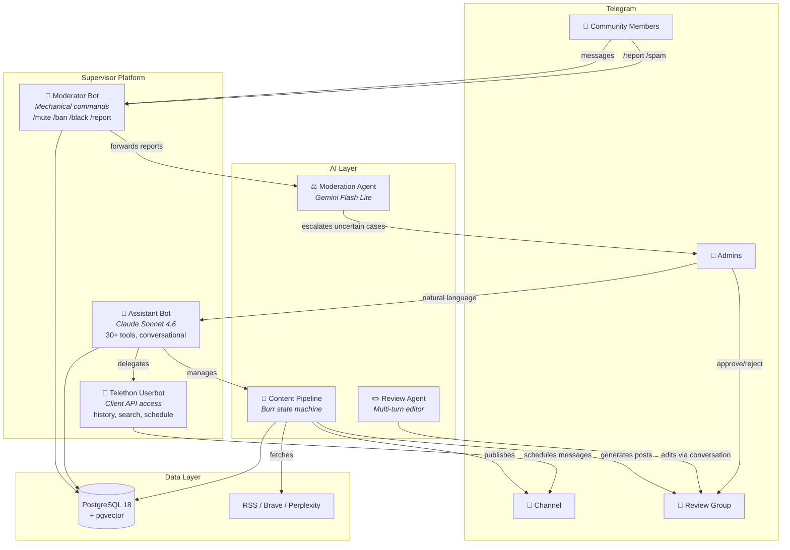
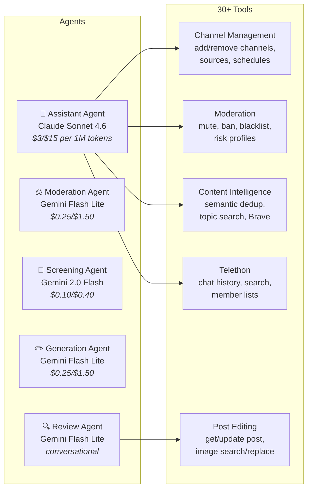
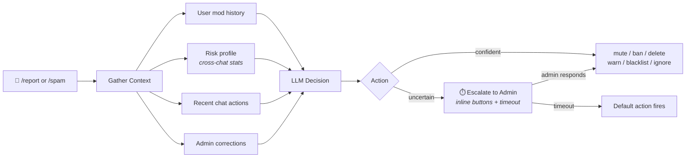
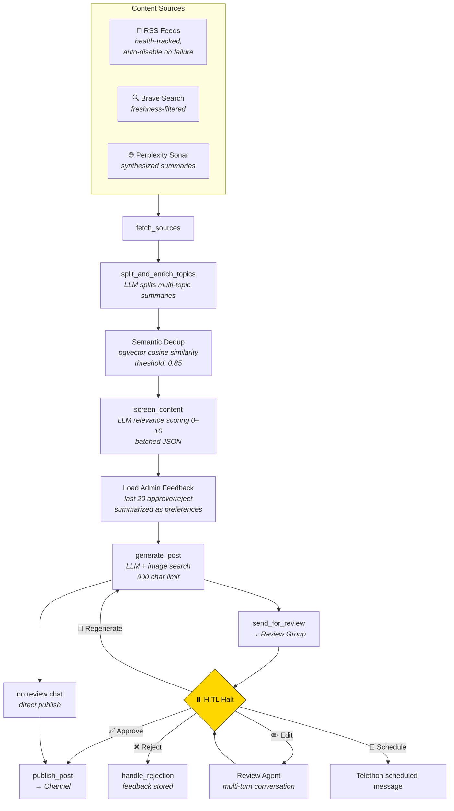

<h1 align="center">Supervisor Telegram</h1>

<p align="center">
  <em>AI-powered community management platform for Telegram</em>
</p>

<p align="center">
  
  
  
  
  
  
  
</p>

---

> **Alpha** — actively developed, core features working in production but APIs and architecture may change.

A multi-agent system that helps Telegram operators keep communities useful,
publish relevant content consistently, and spend less time on repetitive admin
work. Originally built for educational chat communities in the Czech Republic,
it now combines **mechanical moderation**, **AI-assisted publishing**, and a
**conversational admin interface** in one platform.

The system runs **three separate Telegram identities** working in concert: a rule-enforcing moderator bot, an LLM-powered assistant, and a Telethon userbot for Client API features unavailable to standard bots.

## Product Outcomes

- Keep community conversations healthier by handling routine abuse quickly and
  escalating uncertain cases to humans.
- Turn scattered source material into a steady publishing workflow with
  human review where a review channel is configured.
- Let admins manage channels, moderation, publishing, and operating visibility
  from Telegram and authenticated web surfaces instead of stitching together
  separate tools and manual processes.

## Product Capabilities

| Capability group | User value |
|---|---|
| **Community safety** | Routine abuse is handled quickly, while uncertain cases are escalated for human review. |
| **Content operations** | Sources move through intake, screening, drafting, optional review, and publishing in one workflow. |
| **Operator control** | Admins manage moderation, publishing, catalog source data, and spend visibility from coherent operating surfaces. |
| **Learning loop** | Corrections and editorial decisions are preserved so later moderation and content output can reflect operator judgment. |

See [`docs/product/`](docs/product/) for personas, jobs-to-be-done, business
outcomes, product promises, and the separation between capabilities and
technical enablers.

## System Architecture



## Agent Architecture

The platform uses **PydanticAI** agents with typed dependencies and structured outputs, all routed through **OpenRouter** to access different models at different cost/capability tiers.



### Moderation Agent

The moderation agent receives reports and spam flags, gathers context through 4 information-gathering tools, and returns a typed `ModerationResult` with one of 7 possible actions.

**Self-calibrating**: Before each run, the 5 most recent admin override corrections are injected into the system prompt — the agent learns from where humans disagreed with it.



### Content Pipeline

A **Burr state machine** orchestrates the full content lifecycle — from source
fetching to publication. Channels with a review chat halt for human approval;
channels without one publish directly after generation.



**Feedback loop**: The pipeline can retain recent approve/reject decisions and
summarize them into preference context for later generation.

**Source discovery**: Periodically, Perplexity Sonar discovers new RSS feeds for each channel's topic. Each discovered URL is validated by actually fetching it and passes SSRF checks before being stored.

### Assistant Bot

A conversational interface where admins manage everything through natural language. The PydanticAI agent has access to **30+ tools** across 5 domains and maintains per-user conversation history with safe trimming that respects tool call boundaries.

```
Admin: "Run the pipeline for @my_channel"
{🔧 Channel status} ✓ — @my_channel: active
{🔧 Run pipeline} ✓

Pipeline started for @my_channel. 3 sources will be fetched,
screened, and sent to review.
```

```
Admin: "Ban user 123456 in all chats"
{🔧 User info} ✓ — User: @spammer, 47 messages across 3 chats
{🔧 Add to blacklist} ✓

User @spammer added to global blacklist.
Messages revoked in 3 chats.
```

## Tech Stack

| Layer | Technologies |
|---|---|
| **Bot Framework** | aiogram 3.x, Telethon (Client API) |
| **AI/Agents** | PydanticAI, OpenRouter (Claude Sonnet, Gemini Flash, Perplexity Sonar) |
| **State Machine** | Burr (checkpointable HITL workflow) |
| **Database** | PostgreSQL 18 + pgvector, SQLAlchemy 2.x async, Alembic |
| **Search** | Brave Search API (web + images), Perplexity Sonar (synthesis) |
| **Architecture** | Feature-based modular (moderation/channel/assistant), service locator DI |
| **Quality** | ruff, ty (Astral type checker), pytest, pre-commit, structlog |
| **Infrastructure** | Docker multi-stage, uv package manager |

## Project Structure

> See [`docs/architecture.md`](docs/architecture.md) for full module map, config hierarchy, data flow, and design decisions.

```
app/
├── core/                   # Config (9 Pydantic classes), logging, DI, enums, exceptions
├── moderation/             # AI moderation: agent, escalation, blacklist, report, services
├── agent/                  # AI agent infrastructure
│   └── channel/            # Content pipeline
│       ├── orchestrator.py # Per-channel orchestration + scheduling
│       ├── workflow.py     # Burr state machine (9 actions)
│       ├── generator.py    # LLM screening + post generation
│       ├── review/         # Review submodule (agent, presentation, service)
│       ├── semantic_dedup.py
│       ├── sources.py      # RSS fetching + health tracking
│       └── http.py         # SSRF-protected HTTP client
├── assistant/              # Conversational admin bot
│   ├── agent.py            # PydanticAI agent (Claude Sonnet)
│   ├── bot.py              # Conversation management
│   └── tools/              # 30+ tools across 5 modules
├── db/                     # SQLAlchemy models, repositories, session management
├── telethon/               # Telethon userbot client
└── presentation/           # Telegram handlers, middlewares
```

## Quick Start

```bash
# Clone and configure
git clone https://github.com/vsem-azamat/supervisor-telegram.git
cd supervisor-telegram
cp .env.example .env  # fill in MODERATOR_BOT_TOKEN, DB_*, OPENROUTER_API_KEY

# Docker (production)
docker compose up -d

# Or local development
uv sync --dev
uv run alembic upgrade head
uv run -m app.presentation.telegram

# Remote web UI development on a VPS
uv run uvicorn app.webapi.main:app --host 127.0.0.1 --port 8787
pnpm --dir webui run dev  # serves on 0.0.0.0:5174, auth still required
```

## Security

- **SSRF protection** — async DNS validation on all LLM-returned URLs before fetching (14 dedicated tests)
- **Prompt injection defense** — external content sandboxed in XML boundary tags, boundary markers escaped in sanitizer
- **Global blacklist middleware** — TTL-cached, auto-bans across all managed chats
- **Escalation timeouts** — uncertain AI decisions auto-resolve, never left hanging

## License

MIT

## Documentation

Start with the [documentation hub](docs/README.md) for domain rules,
architecture, testing strategy, and project learnings.
