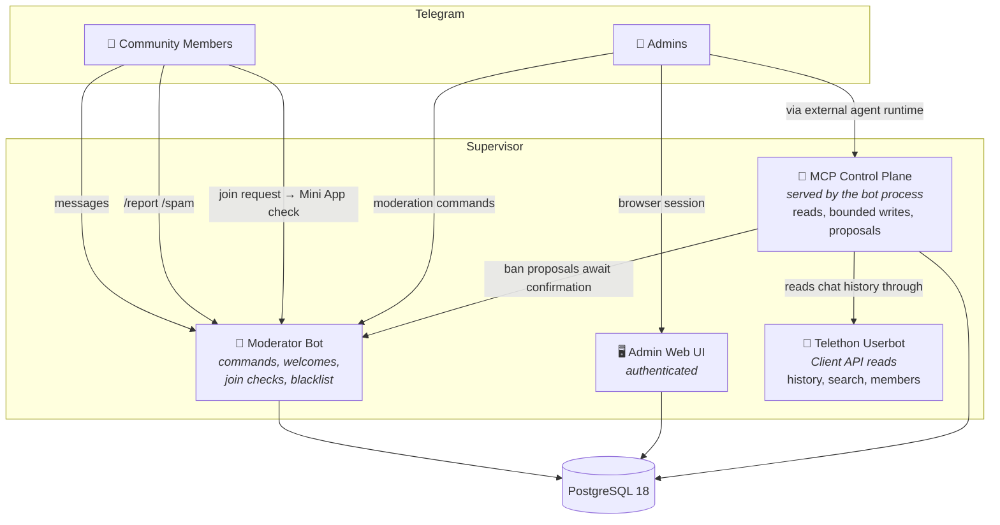

<h1 align="center">Supervisor Telegram</h1>

<p align="center">
  <em>Moderation and admin tooling for Telegram communities</em>
</p>

<p align="center">
  
  
  
  
</p>

---

> **Alpha** — actively developed, core features working in production but APIs and architecture may change.

Supervisor Telegram keeps a set of group chats moderated and gives the people
who run them somewhere to work from. It was built for educational chat
communities in the Czech Republic and still reflects that: many chats, few
admins, and the same handful of problems arriving every day.

The system runs **two Telegram identities**: a moderator bot that enforces rules
and answers admin commands, and a Telethon userbot for Client API reads a bot
token cannot make. Admin work happens through bot commands, an authenticated web
UI, and an MCP control plane an external agent runtime can drive.

Decisions that remove a person stay with a human. Nothing in this system bans on
its own judgement.

See [`docs/product/`](docs/product/) for who it serves and what is deliberately
out of scope.

## System Architecture


```mermaid
graph TB
    subgraph Telegram["Telegram"]
        Users["👥 Community Members"]
        Admins["👮 Admins"]
    end

    subgraph System["Supervisor"]
        ModBot["🤖 Moderator Bot<br/><i>commands, welcomes,<br/>join checks, blacklist</i>"]
        MCP["🔌 MCP Control Plane<br/><i>served by the bot process</i><br/>reads, bounded writes, proposals"]
        WebUI["🖥️ Admin Web UI<br/><i>authenticated</i>"]
        Userbot["👤 Telethon Userbot<br/><i>Client API reads</i><br/>history, search, members"]
    end

    PG[("PostgreSQL 18")]

    Users -->|messages| ModBot
    Users -->|/report /spam| ModBot
    Users -->|join request → Mini App check| ModBot
    Admins -->|moderation commands| ModBot
    Admins -->|browser session| WebUI
    Admins -->|via external agent runtime| MCP
    MCP -->|ban proposals await confirmation| ModBot
    MCP -->|reads chat history through| Userbot
    ModBot --> PG
    WebUI --> PG
    MCP --> PG
```

## MCP Control Plane

Day-to-day admin work happens through moderator-bot commands and the
authenticated web UI. Alongside them, the bot process can serve an **MCP
endpoint** so an agent runtime living outside this repository drives the same
admin surface from whatever chat the operator already uses.

The boundary is what a leaked token can do, not which tools exist: reads never
reach outside the chats this deployment manages, and writes are reversible or
self-expiring. Removing a person is never carried out by a tool call at all; a
ban is *proposed*, and a super admin confirms it in the moderator bot or it
expires having done nothing. The plane stays closed unless `MCP_TOKEN` is set,
and it is not published to the internet. The rules it rests on are in
[`docs/invariants.md`](docs/invariants.md).

## Tech Stack

| Layer | Technologies |
|---|---|
| **Bot Framework** | aiogram 3.30 (Bot API), Telethon (Client API) |
| **Database** | PostgreSQL 18, SQLAlchemy 2.x async, Alembic |
| **Web API** | FastAPI, session cookies from a verified Telegram Mini App `initData` |
| **Web UI** | SvelteKit 2, Svelte 5, Tailwind 4 |
| **Control plane** | MCP over HTTP (FastMCP), bearer-token auth, served by the bot process |
| **Architecture** | Feature-based modular packages, service locator DI |
| **Quality** | ruff, ty (Astral type checker), pytest, pre-commit, structlog |
| **Infrastructure** | Docker multi-stage, uv package manager |

> Structure is deliberately not mirrored here — read `app/` for it, and
> [`docs/invariants.md`](docs/invariants.md) for the rules the code cannot state.

## Quick Start

Production is configured through GitHub secrets and variables and keeps no
`.env` — see [production credentials](docs/deployment/production-credentials.md).
The file below is for working locally.

```bash
# Clone and configure
git clone https://github.com/vsem-azamat/supervisor-telegram.git
cd supervisor-telegram
cp .env.example .env  # fill in MODERATOR_BOT_TOKEN, DB_*, ADMIN_SUPER_ADMINS

# Local development
uv sync --dev
uv run alembic upgrade head
uv run -m app.presentation.telegram

# Remote web UI development on a VPS
uv run uvicorn app.webapi.main:app --host 127.0.0.1 --port 8787
pnpm --dir webui run dev  # serves on 0.0.0.0:5174, auth still required
```

## Security

- **Approval gate** — the bot records what it sees in an unapproved chat but
  takes no public action there.
- **Global blacklist middleware** — TTL-cached, bans a listed user again on
  sight across every managed chat.
- **Mini App join checks** — the applicant is bound to the join request at issue
  time, so holding the link is not the same as being the person it was for.
- **Confirmed removals** — bans and blacklist entries proposed by the control
  plane wait for a super admin's press, or expire.

## License

MIT

## Documentation

- [`AGENTS.md`](AGENTS.md) — the working contract.
- [`docs/invariants.md`](docs/invariants.md) — rules the code cannot state for
  itself. Behaviour is pinned by tests, not prose.
- [`docs/deployment/`](docs/deployment/) — operational runbooks.
- [`docs/product/`](docs/product/) — what this is for and who it serves.
