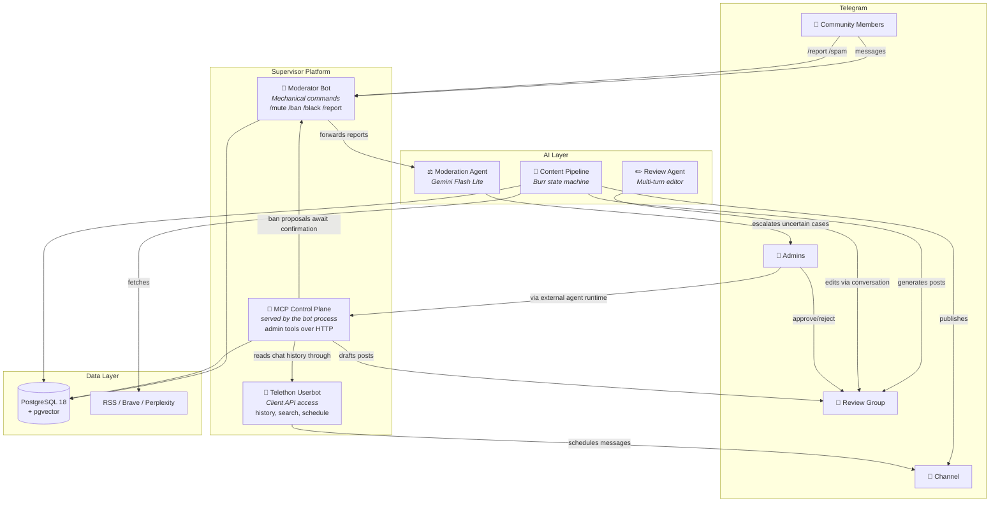
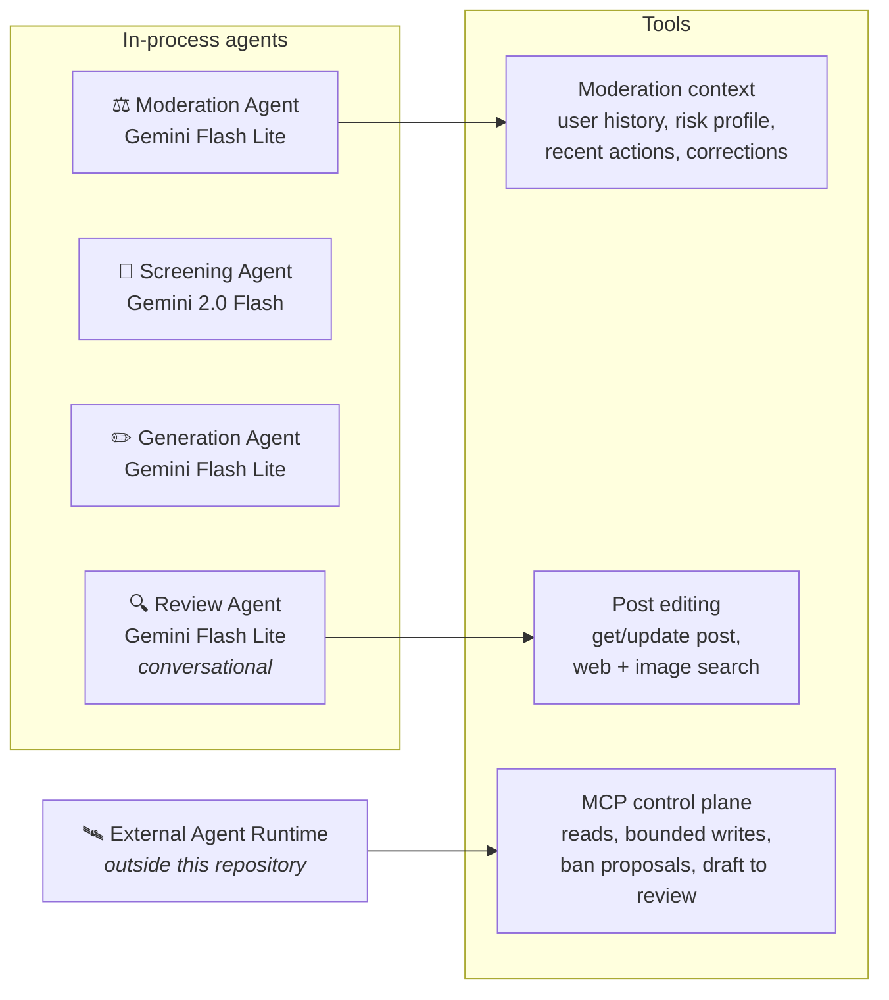
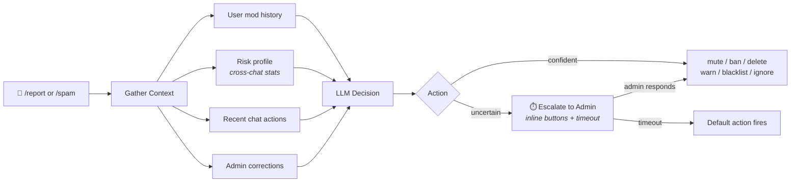
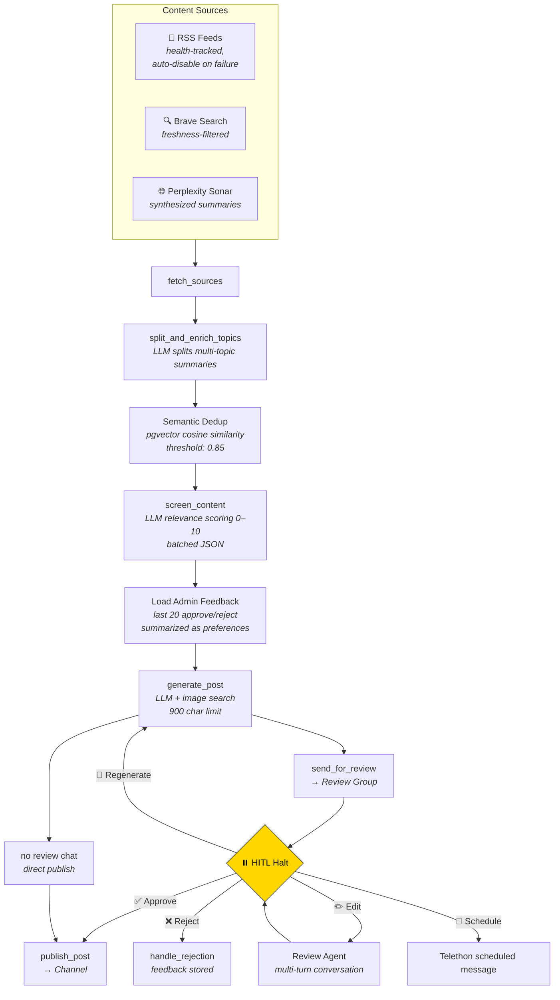

<h1 align="center">Supervisor Telegram</h1>

<p align="center">
  <em>AI-powered community management platform for Telegram</em>
</p>

<p align="center">
  
  
  
  
  
  
  
</p>

---

> **Alpha** — actively developed, core features working in production but APIs and architecture may change.

A multi-agent system that helps Telegram operators keep communities useful,
publish relevant content consistently, and spend less time on repetitive admin
work. Originally built for educational chat communities in the Czech Republic,
it now combines **mechanical moderation**, **AI-assisted publishing**, and
**admin control surfaces** in one platform.

The system runs **two Telegram identities** working in concert: a rule-enforcing moderator bot, and a Telethon userbot for Client API features unavailable to standard bots. Admin work happens through Telegram commands, an authenticated web UI, and an MCP control plane an external agent runtime can drive.

## Product Outcomes

- Keep community conversations healthier by handling routine abuse quickly and
  escalating uncertain cases to humans.
- Turn scattered source material into a steady publishing workflow with
  human review where a review channel is configured.
- Let admins manage channels, moderation, publishing, and operating visibility
  from Telegram and authenticated web surfaces instead of stitching together
  separate tools and manual processes.

## Product Capabilities

| Capability group | User value |
|---|---|
| **Community safety** | Routine abuse is handled quickly, while uncertain cases are escalated for human review. |
| **Content operations** | Sources move through intake, screening, drafting, optional review, and publishing in one workflow. |
| **Operator control** | Admins manage moderation, publishing, catalog source data, and spend visibility from coherent operating surfaces. |
| **Learning loop** | Corrections and editorial decisions are preserved so later moderation and content output can reflect operator judgment. |

See [`docs/product/`](docs/product/) for personas, jobs-to-be-done, business
outcomes, product promises, and the separation between capabilities and
technical enablers.

## System Architecture


```mermaid
graph TB
    subgraph Telegram["Telegram"]
        Users["👥 Community Members"]
        Admins["👮 Admins"]
        Channel["📢 Channel"]
        ReviewGroup["📝 Review Group"]
    end

    subgraph System["Supervisor Platform"]
        ModBot["🤖 Moderator Bot<br/><i>Mechanical commands</i><br/>/mute /ban /black /report"]
        MCP["🔌 MCP Control Plane<br/><i>served by the bot process</i><br/>admin tools over HTTP"]
        Userbot["👤 Telethon Userbot<br/><i>Client API access</i><br/>history, search, schedule"]
    end

    subgraph AI["AI Layer"]
        ModAgent["⚖️ Moderation Agent<br/><i>Gemini Flash Lite</i>"]
        Pipeline["📰 Content Pipeline<br/><i>Burr state machine</i>"]
        ReviewAgent["✏️ Review Agent<br/><i>Multi-turn editor</i>"]
    end

    subgraph Data["Data Layer"]
        PG[("PostgreSQL 18<br/>+ pgvector")]
        Sources["RSS / Brave / Perplexity"]
    end

    Users -->|messages| ModBot
    Users -->|/report /spam| ModBot
    Admins -->|via external agent runtime| MCP
    ModBot -->|forwards reports| ModAgent
    ModAgent -->|escalates uncertain cases| Admins
    MCP -->|drafts posts| ReviewGroup
    MCP -->|ban proposals await confirmation| ModBot
    MCP -->|reads chat history through| Userbot
    Pipeline -->|fetches| Sources
    Pipeline -->|generates posts| ReviewGroup
    ReviewAgent -->|edits via conversation| ReviewGroup
    Admins -->|approve/reject| ReviewGroup
    Pipeline -->|publishes| Channel
    Userbot -->|schedules messages| Channel
    ModBot --> PG
    MCP --> PG
    Pipeline --> PG
```

## Agent Architecture

The platform uses **PydanticAI** agents with typed dependencies and structured outputs, all routed through **OpenRouter** to access different models at different cost/capability tiers.


```mermaid
graph LR
    Runtime["🛰️ External Agent Runtime<br/><i>outside this repository</i>"]

    subgraph Agents["In-process agents"]
        A2["⚖️ Moderation Agent<br/>Gemini Flash Lite"]
        A3["📰 Screening Agent<br/>Gemini 2.0 Flash"]
        A4["✏️ Generation Agent<br/>Gemini Flash Lite"]
        A5["🔍 Review Agent<br/>Gemini Flash Lite<br/><i>conversational</i>"]
    end

    subgraph Tools["Tools"]
        T2["Moderation context<br/>user history, risk profile,<br/>recent actions, corrections"]
        T5["Post editing<br/>get/update post,<br/>web + image search"]
        T6["MCP control plane<br/>reads, bounded writes,<br/>ban proposals, draft to review"]
    end

    A2 --> T2
    A5 --> T5
    Runtime --> T6
```

### Moderation Agent

The moderation agent receives reports and spam flags, gathers context through 4 information-gathering tools, and returns a typed `ModerationResult` with one of 7 possible actions.

**Self-calibrating**: Before each run, the 5 most recent admin override corrections are injected into the system prompt — the agent learns from where humans disagreed with it.


```mermaid
flowchart LR
    Report["🚩 /report or /spam"] --> Gather["Gather Context"]
    Gather --> History["User mod history"]
    Gather --> Risk["Risk profile<br/><i>cross-chat stats</i>"]
    Gather --> Recent["Recent chat actions"]
    Gather --> Corrections["Admin corrections"]
    History & Risk & Recent & Corrections --> Decide["LLM Decision"]
    Decide --> Actions{Action}
    Actions -->|confident| Execute["mute / ban / delete<br/>warn / blacklist / ignore"]
    Actions -->|uncertain| Escalate["⏱️ Escalate to Admin<br/><i>inline buttons + timeout</i>"]
    Escalate -->|admin responds| Execute
    Escalate -->|timeout| Default["Default action fires"]
```

### Content Pipeline

A **Burr state machine** orchestrates the full content lifecycle — from source
fetching to publication. Channels with a review chat halt for human approval;
channels without one publish directly after generation.


```mermaid
flowchart TB
    subgraph Sources["Content Sources"]
        RSS["📡 RSS Feeds<br/><i>health-tracked,<br/>auto-disable on failure</i>"]
        Brave["🔍 Brave Search<br/><i>freshness-filtered</i>"]
        Sonar["🌐 Perplexity Sonar<br/><i>synthesized summaries</i>"]
    end

    Sources --> Fetch["fetch_sources"]
    Fetch --> Split["split_and_enrich_topics<br/><i>LLM splits multi-topic summaries</i>"]
    Split --> Dedup["Semantic Dedup<br/><i>pgvector cosine similarity</i><br/><i>threshold: 0.85</i>"]
    Dedup --> Screen["screen_content<br/><i>LLM relevance scoring 0–10</i><br/><i>batched JSON</i>"]
    Screen --> Feedback["Load Admin Feedback<br/><i>last 20 approve/reject<br/>summarized as preferences</i>"]
    Feedback --> Generate["generate_post<br/><i>LLM + image search</i><br/><i>900 char limit</i>"]
    Generate --> Review["send_for_review<br/><i>→ Review Group</i>"]
    Generate --> Direct["no review chat<br/><i>direct publish</i>"]
    Review --> HITL{"⏸️ HITL Halt"}
    HITL -->|"✅ Approve"| Publish["publish_post<br/><i>→ Channel</i>"]
    Direct --> Publish
    HITL -->|"✏️ Edit"| Agent["Review Agent<br/><i>multi-turn conversation</i>"]
    Agent --> HITL
    HITL -->|"❌ Reject"| Reject["handle_rejection<br/><i>feedback stored</i>"]
    HITL -->|"🔄 Regenerate"| Generate
    HITL -->|"📅 Schedule"| Schedule["Telethon scheduled message"]

    style HITL fill:#ffd700,stroke:#333,color:#000
```

**Feedback loop**: The pipeline can retain recent approve/reject decisions and
summarize them into preference context for later generation.

**Source discovery**: Periodically, Perplexity Sonar discovers new RSS feeds for each channel's topic. Each discovered URL is validated by actually fetching it and passes SSRF checks before being stored.

### MCP Control Plane

Day-to-day admin work happens through moderator-bot commands and the
authenticated web UI. Alongside them, the bot process can serve an **MCP endpoint**
so an agent runtime living outside this repository drives the same admin surface
from whatever chat the operator already uses.

The boundary is what a leaked token can do, not which tools exist: reads never
reach outside the chats and channels this deployment manages, writes are
reversible or self-expiring, and generation can only reach a review chat — never
publish. Removing a person is never carried out by a tool call at all; a ban is
*proposed*, and a super admin confirms it in the moderator bot or it expires
having done nothing. The plane stays closed unless
`MCP_TOKEN` is set. The rules it rests on are in
[`docs/invariants.md`](docs/invariants.md).

## Tech Stack

| Layer | Technologies |
|---|---|
| **Bot Framework** | aiogram 3.30 (Bot API 10.2), Telethon (Client API) |
| **AI/Agents** | PydanticAI, OpenRouter (Claude Sonnet, Gemini Flash, Perplexity Sonar) |
| **State Machine** | Burr (checkpointable HITL workflow) |
| **Database** | PostgreSQL 18 + pgvector, SQLAlchemy 2.x async, Alembic |
| **Search** | Brave Search API (web + images), Perplexity Sonar (synthesis) |
| **Architecture** | Feature-based modular packages, service locator DI |
| **Control plane** | MCP over HTTP (FastMCP), bearer-token auth, served by the bot process |
| **Quality** | ruff, ty (Astral type checker), pytest, pre-commit, structlog |
| **Infrastructure** | Docker multi-stage, uv package manager |

> Structure is deliberately not mirrored here — read `app/` for it, and
> [`docs/invariants.md`](docs/invariants.md) for the rules the code cannot state.

## Quick Start

Production is configured through GitHub secrets and variables and keeps no
`.env` — see [production credentials](docs/deployment/production-credentials.md).
The file below is for working locally.

```bash
# Clone and configure
git clone https://github.com/vsem-azamat/supervisor-telegram.git
cd supervisor-telegram
cp .env.example .env  # fill in MODERATOR_BOT_TOKEN, DB_*, ADMIN_SUPER_ADMINS

# Local development
uv sync --dev
uv run alembic upgrade head
uv run -m app.presentation.telegram

# Remote web UI development on a VPS
uv run uvicorn app.webapi.main:app --host 127.0.0.1 --port 8787
pnpm --dir webui run dev  # serves on 0.0.0.0:5174, auth still required
```

## Security

- **SSRF protection** — async DNS validation on all LLM-returned URLs before fetching
- **Prompt injection defense** — external content sandboxed in XML boundary tags, boundary markers escaped in sanitizer
- **Global blacklist middleware** — TTL-cached, auto-bans across all managed chats
- **Escalation timeouts** — uncertain AI decisions auto-resolve, never left hanging

## License

MIT

## Documentation

- [`AGENTS.md`](AGENTS.md) — the working contract.
- [`docs/invariants.md`](docs/invariants.md) — rules the code cannot state for
  itself. Behaviour is pinned by tests, not prose.
- [`docs/deployment/`](docs/deployment/) — operational runbooks.
- [`docs/product/`](docs/product/) — what this is for and who it serves.
